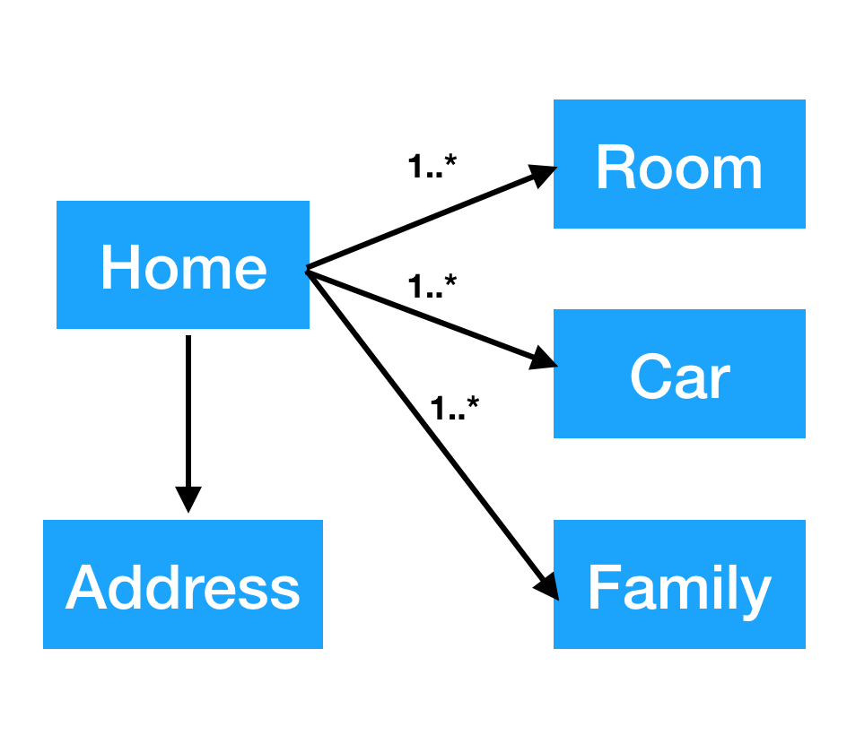

# nested-fields-support

This plugin adds support for nested fields to Kibana. This is based off of the 
work from my fork of [Kibana](https://github.com/homeaway/kibana).

See the [Releases](https://github.com/ppadovani/KibanaNestedSupportPlugin/releases) for a list of releases. Each version of this plugin reflects the version of the Kibana release it supports.

If a release doesn't exist for your version of Kibana, create an issue with the "Kibana version support" label. The release issues with the highest vote count will get first priority!

Contributions of fixes, features etc. are welcome!

## Installation ##

Find the release that supports your version. The release numbers for this plugin mimic those of Kibana. So the 5.6.6 release of Kibana should use the 5.6.6-1.0.0 version of this plugin. To install this plugin:

1. Get a command line prompt in the home directory of your Kibana release
2. Find the url for this plugin's supported build for your release of Kibana. For example the supported version of this plugin for current release of Kibana 5.6.6 is [](https://github.com/ppadovani/KibanaNestedSupportPlugin/releases/download/5.6.6-1.0.0/nested-fields-support-5.6.6-1.0.0.zip).
3. Issue this command: bin/kibana-plugin install ["url-to-plugin-release-zip"]()

## X-Pack Installation ##

If you are using x-pack with Kibana, you must configure a new role that gives access 
to the index mappings elasticsearch API. In order to do so, login to Kibana with a
user that has administrative authority. Then create a new role that is configured
like:


Once the role is configured, assign the role to the user that has authority to
manage Kibana. **NOTE** You cannot add this new role to the out of the box users
created by x-pack, and you cannot activate nested support for an index without 
this role.

## Nested query and aggregation support for Kibana ##

## Background ##
 


The above model illustrates a simple parent child relationship that might exist in one an indexed document. 
The home document contains an address, one or more rooms, one or more family members, and one or more cars. 
Within Elasticsearch this entity can be stored as multiple documents in a parent child relationship, or as a single 
document where the child objects are 'nested'. This plugin uses this model for testing purposes, and the mapping and 
python script used to populate Elasticsearch with test data is contained in the scripts directory of this project.

For standard Elasticsearch queries against the Elasticsearch API, querying against such an index requires some special 
handling and knowledge around what fields are actually nested in the index schema and what the nested path is to the 
child object. For additional details on nested queries please see 
[nested query documentation](https://www.elastic.co/guide/en/elasticsearch/reference/current/query-dsl-nested-query.html 
nested query documentation). 

## The Issue ##

1. Kibana doesn't parse the query entered, and instead relies on Elasticsearch to [parse the query for it](https://www.elastic.co/guide/en/elasticsearch/reference/current/query-dsl-query-string-query.html parse the query for it). This leads to several issues:
  * No feedback when a query contains a field that doesn't exist in the index and returns no results.
  * No feedback if an invalid type for a field is used (date for a boolean field) and returns no results.
  * Feedback provided for invalid query syntax returns as an exception stack trace that can be difficult to decipher.
2. Kibana doesn't know what fields are nested due to the way it loads the index mapping when an index is configured.

## Solution ##

This plugin solves the nested issue with the following changes:

1. Add a management section to enable/disable nested support for a particular indexPattern. This will add the needed 
nested path data to each nested field and flip a boolean flag on the indexPattern itself.

2. Add a new SQL like query language: Kibana Nested Query Language (KNQL) that is parsed within Kibana and outputs native elasticsearch queries. This 
language understands the fields and what fields are nested in order to properly create native queries.

3. Update the Discovery application to use the new query parser if an indexPattern has a nested flag set to true

4. Update the underlying aggregation code to honor nested configuration within an indexPattern if present.

5. **TBD** Update the discovery application to properly format and display nested data within the search results.

## Index Pattern Management ##

Adding support to an indedPattern requires that the indexPattern be defined first using the normal Kibana management
application. Once the indexPattern has been created, select the new 'Nested Fields' management section:


Next find the indexPattern from the list, and use the button on the far right to enable nested support:


**Note: At this time, if you refresh an indexPattern, you must deactivate/activate nested support to reload the 
nestedPath information into the indexPattern. **


## KNQL - Query Language ## 

I will not go into details about how/what code changes were made to support this effort, instead I wish to focus on documentation and usage examples for the new query DSL.

Here is the basic BNF:

  * expressions : e \| ANY

  * booleanValue : TRUE \| FALSE

  * fieldPath : FIELD \| fieldPath DOT FIELD | fieldPath DOT ANY | FIELD ANY

  * decimal : NUMBER DOT NUMBER

  * dateTime : date TIME

  * rangeLiteral : [( simpleValue COMMA simpleValue )]

  * setValue : simpleValue \| setValue COMMA simpleValue

  * setLiteral : { setValue }

  * inClause : fieldPath IN rangeLiteral \| fieldPath IN setLiteral

  * EXISTS : EXISTS fieldPath | EXISTS e

  * simpleValue : decimal \| NUMBER \| STRING \| NULL \| booleanValue \| IPV4 \| date \| dateTime

  * operator : = \| ~= \| >= \| <= \| > \| <

  * comparison : fieldPath operator simpleValue

  * boolExpression : e AND e \| e OR e

  * unaryExpression : NOT e \| EXISTS e

  * e : booleExpression \| unaryExpression \| comparison \| fieldPath \| inClause \| isClause \| ( e )

NOTE: The ~= operator allows for wildcard queries.: field ~= "test*"

In a nutshell the above allows one to type a query that looks something like:

`````(a.b=true AND c.d IN {"a","b","c"} AND date>=2015-01-01) OR (d.e=FALSE AND NOT f.g IS NULL)`````

The * character, which represents ANY, can be used in two fundamental ways outside of a wildcard.

1. * by itself in a query with no other characters equates to a match all query.
2. Using a * in conjunction with a field name equates to a multi_match lenient query. This query allows 
the user to specify a field like a wildcard and match one value against multiple fields.

```field*="cookie"``` 

So how does the new query language solve our problem?

1. By parsing the queries in Kibana we have the ability to syntax check the query BEFORE it is converted to an Elasticsearch query.
2. The modified the Kibana code to load the nested information about an index, and pass the index information to the query parser. This allows:
  * Field validation and feedback for invalid fields
  * Type validation against the values contained in the query
  * Nested query generation support
  
More importantly, by implementing #2 above, this same nested information about a field is now stored in the Kibana index, and can be leveraged by the aggregation query generation code. 

One of the first questions that may come to mind for many of you familiar with Kibana, is 'What about existing saved queries that use the Elasticsearch query string, or custom JSON queries?' The good news is that you can still use both of those. The code that was developed detects which kind of query was placed in the query field and acts accordingly. Queries saved and reloaded also are properly detected and acted on. 

### Error Handling Examples ###

__NOTE:__ In order to avoid issues with native Kibana queries, indexPatterns that have nested support turned on can
only use the above query language.

When typing the query, the query is constantly parsed. In this example a single letter 'l' was typed which did not match any known field in the index. Please note that the existing type ahead still works.


In this example, the query is not correctly formed as it doesn't contain a value:


Finally, if the user attempts to put a value that doesn't match the type of the field, the parser will send an error.


### Nested Queries ###

In general you will never notice that nested queries are being generated, as this is done for you in the query parser. 
There are cases where a complex query requires that the nested fields be scoped correctly in order to return the correct 
results. This is where the unary EXISTS comes into play. The EXISTS provides a mechanism to scope a set of nested 
conditions together into a single condition. The thought here is that the use of EXISTS is checking for the existence 
of one or more nested objects within the parent.

Consider this query based on the simple home model defined above, where an home contains two car objects. car 
object #1 has a make of Honda, and car object #2 has a make of Acura.:

```roof="steel" AND ( cars_size=0 OR NOT car.make IN {"Lexus","Acura"})``` 

This query returns the wrong results because it was able to match one of the two nested car objects. What this query 
did was test each individual car against the "IN {"Lexus","Acura"}" rather than against the entire set of car objects. 
If the search was changed to use exists the correct result should be returned (no results in this case).

```roof="steel" AND ( cars_size=0 OR NOT EXISTS car.make IN {"Lexus","Acura"}) ```

When using EXISTS, whatever follows EXISTS as an expression, including surrounding the expression in parentheses, will 
be scoped to that one nested expression. You can use EXISTS multiple times within the same query as well.

```roof="steel" AND ( cars_size=0 OR NOT EXISTS car.make = "Lexus" OR NOT EXISTS car.make = "Acura")``` 

Please note that when saving a new style query, the next time it is loaded EXISTS unaries will be automatically injected for each scoped nested query. This happens because the query stored in the Kibana index is actually the Elasticsearch JSON query generated by the parser, and it must be reverse parsed back into the new style query language.

## Aggregation Support ##

Aggregation support for indexPatterns that have nested turned on is generally seamless. As shown in the pie chart
example below:


The above example split the slices by cars.make, then by cars.color then finally by family.givenName. The nested 
aggregations that were required were automatically injected into the aggregation query based on the information
stored in the indexPattern. Note that the third aggregation is a nested aggregation in a completely different
set of nested objects from the previous aggregations. The query generated for the above example is shown below:

```
{
     "size": 0,
     "query": {
       "match_all": {}
     },
     "_source": {
       "excludes": []
     },
     "aggs": {
       "nested_2": {
         "nested": {
           "path": "cars"
         },
         "aggs": {
           "2": {
             "terms": {
               "field": "cars.make",
               "size": 5,
               "order": {
                 "_count": "desc"
               }
             },
             "aggs": {
               "3": {
                 "terms": {
                   "field": "cars.color",
                   "size": 5,
                   "order": {
                     "_count": "desc"
                   }
                 },
                 "aggs": {
                   "nested_4": {
                     "nested": {
                       "path": "family"
                     },
                     "aggs": {
                       "4": {
                         "terms": {
                           "field": "family.givenName",
                           "size": 5,
                           "order": {
                             "_count": "desc"
                           }
                         }
                       }
                     }
                   }
                 }
               }
             }
           }
         }
       }
     }
   }
   ```

There is one exception to this 'automatic' handling of aggregations. If you wish to have the parent aggregation be the
aggregation used for the official count of the bucket contents, you must check the 'use count of parent document' box
to enable this functionality.

## Discover Application Enhancements ##

There are three major enhancements made to the discover application by this plugin: field display priority;
nested field support.

### Typeahead Support for Fields ###

The existing typeahead support in Kibana has been enhanced to support showing you completions for
fields that you are typing in the query bar. These suggestions appear at the bottom of the list of
typeahead suggestions. Additionally, the typeahead area is now limited in height and will support a
scroll bar. As you use fields from the typeahead list, they will bubble up towards the top of the
list the more you use them per the existing Kibana functionality.

### Field Display Priority ###

This feature allows a Kibana administrator to configure the order and/or hide fields within the summary text
of discover results. By ordering the field display priority search results can be tailored to the
index contents in order to allow users to easily find what they might be looking for. To configure the 
discover settings for a particular index, click on the 'Discover Settings' section within the management application.
This will bring up a view that looks like this:


In the above image, the 'homes' index is selected, and a list of fields is displayed. Below the field list
will appear a single sample from the selected index in for the user to see the results of their
changes. The user can adjust each individual field up or down. Priorities are displayed greatest to least.
A value of -1 will hide the field altogether from the summary results.

NOTE: If an index does not have nested support turned on, the display priority settings on nested fields
will not function as expected and is not supported.

### Nested Field Support ###

The Discover application does not support nested objects when viewing a result's details. Instead it
displays a JSON formatted string as shown below:


In order to address this issue, a new document view has been added called 'Structured'. An example of this
view is shown below:


Arrays/Lists of nested objects are shown in a scrollable list. If an index contains nested objects,
but is not marked as nested, the structured viewer will behave as the eisting table viewer.

---

## Development


See the [kibana contributing guide](https://github.com/elastic/kibana/blob/master/CONTRIBUTING.md) for instructions setting up your development environment. Once you have completed that, use the following npm tasks.

  - `npm install jison-gho -g`
     
     Install the jison parser tooling

  - `npm install`
  
    Install required dependencies

  - `npm start`

    Start kibana and have it include this plugin

  - `npm start -- --config kibana.yml`

    You can pass any argument that you would normally send to `bin/kibana` by putting them after `--` when running `npm start`

  - `npm run build`

    Build a distributable archive

  - `npm run test:browser`

    Run the browser tests in a real web browser

  - `npm run test:server`

    Run the server tests using mocha

For more information about any of these commands run `npm run ${task} -- --help`.

## Grammer changes

Changes to the grammer must be made in the knql.jison file. Once those changes are made the knql.js 
file must be rebuilt using the command:

`jison knql.jison -p slr`
